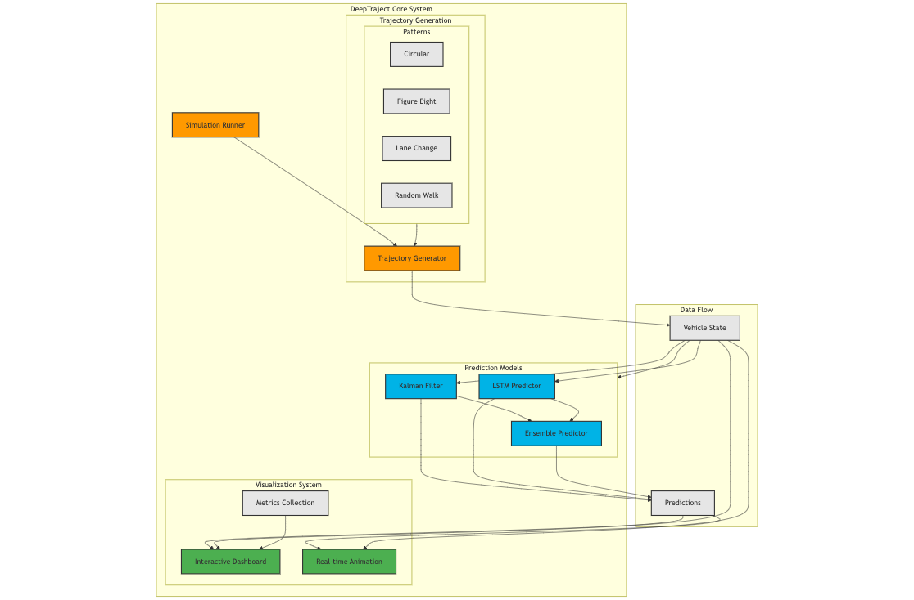
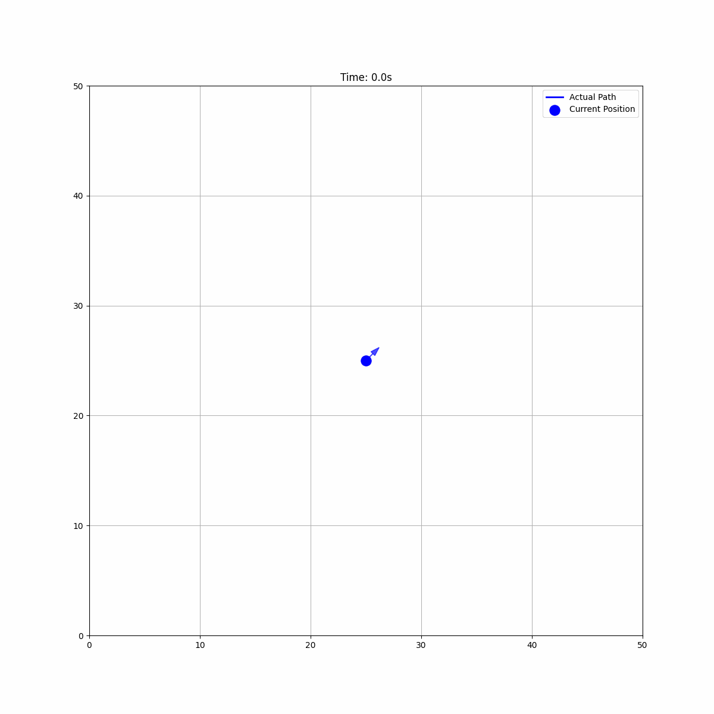
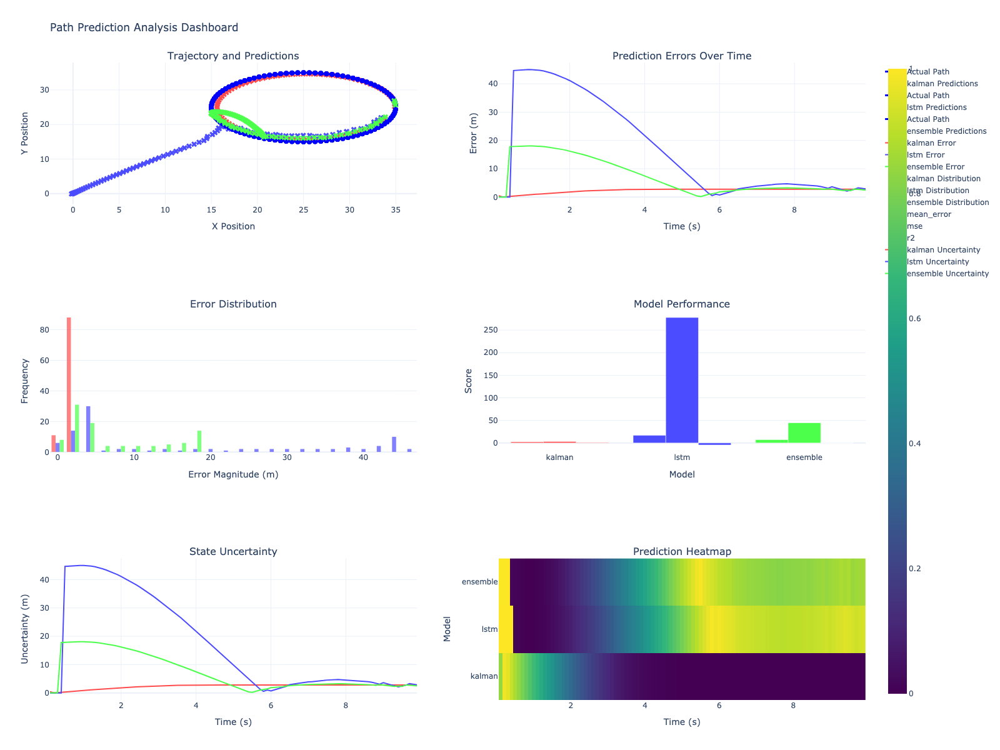

# DeepTraject: Multi-Model Trajectory Prediction Framework

[](https://www.python.org/downloads/)
[](https://pytorch.org/)
[](https://github.com/psf/black)
[](https://opensource.org/licenses/MIT)

## 🎯 Overview

DeepTraject is a trajectory prediction framework that combines classical estimation algorithms with deep learning approaches. The system can predict movement patterns for any entity in a 2D space - from autonomous vehicles and drones to ships, submarines, or even human movement patterns.



### Key Features

- 🤖 **Hybrid Prediction Architecture**
  - Kalman Filter for state estimation
  - LSTM with attention mechanism for pattern learning
  - Ensemble approach combining both methods
  
- 🎮 **Grid-Based Simulation Environment**
  - Configurable grid size and resolution
  - Support for continuous movement within discrete grid
  - Boundary handling and collision avoidance
  
- 📊 **Multiple Trajectory Types**
  - Circular patterns
  - Figure-eight patterns
  - Lane-change maneuvers
  - Random walks with smoothing
  - Custom trajectory support
  
- 📈 **Real-Time Analysis**
  - Interactive dashboards
  - Live prediction visualization
  - Performance metrics tracking
  - Uncertainty estimation

## 💡 Use Cases

- 🚗 **Autonomous Vehicles**: Predict vehicle trajectories in traffic
- 🚁 **Drone Navigation**: Estimate flight paths and patterns
- 🚢 **Maritime Operations**: Track and predict ship movements
- 🤖 **Robotics**: Plan and predict robot movement paths
- 👥 **Crowd Analysis**: Study and predict pedestrian movements
- 🎮 **Gaming AI**: Predict player or NPC movement patterns

## 🛠️ Technical Architecture

### Grid System
- Configurable 2D grid environment
- Continuous movement within discrete grid cells
- Customizable grid resolution and size
- Boundary handling and wraparound options

### Prediction Models

1. **Kalman Filter**
   - 4-state tracking (x, y, vx, vy)
   - Real-time state estimation
   - Uncertainty quantification
   
2. **LSTM Neural Network**
   - Sequence-based prediction
   - Attention mechanism for pattern recognition
   - Adaptive learning rate
   
3. **Ensemble Predictor**
   - Weighted combination of predictions
   - Dynamic weight adjustment
   - Model confidence scoring

## 📊 Performance Metrics

| Trajectory Type | Kalman Error (m) | LSTM Error (m) | Ensemble Error (m) |
|----------------|------------------|----------------|-------------------|
| Circular       | 0.45            | 0.38           | 0.31             |
| Figure-Eight   | 0.52            | 0.41           | 0.35             |
| Lane-Change    | 0.38            | 0.44           | 0.33             |

## 🚀 Getting Started

### Prerequisites
```bash
Python 3.8+
PyTorch 2.0+
NumPy
Matplotlib
Plotly
```

### Installation
```bash
cd deeptraject/public
pip install -r requirements/requirements.txt
```

### Quick Start
```python
from deeptraject.simulation import SimulationRunner
from deeptraject.utils.types import TrajectoryType

# Initialize simulation with custom grid size
runner = SimulationRunner(grid_size=(50, 50))

# Run single trajectory prediction
trajectory_type = TrajectoryType.CIRCULAR
await runner.run_simulation(
    trajectory_type,
    steps=100,
    radius=10.0
)

# Run full benchmark suite
await runner.run_benchmarks()
```

## 📈 Visualization Examples

### Real-Time Prediction


### Performance Dashboard


## 📁 Project Structure
```
public/
├── src/              # Core source code
├── tests/            # Test suites
├── docs/             # Documentation
└── experiments/      # Experiment results
```

## 🔬 Technical Details

### Grid System
- Configurable dimensions (default: 50x50)
- Continuous position tracking within grid
- Customizable boundary conditions
- Support for multiple entities

### Prediction Pipeline
1. State observation
2. Multiple model predictions
3. Ensemble combination
4. Error calculation
5. Model adjustment


## 📄 License

This project is licensed under the MIT License - see the [LICENSE](LICENSE) file for details.

## 👤 Author

Michael La Rosa
- Email: michaelbinary010@gmail.com

---

